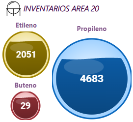

# 🟦 Power BI Custom Visual - Liquid Industrial Gauge

Visual personalizado para Power BI que representa valores mediante una **esfera industrial con efecto líquido**, completamente configurable y optimizado para dashboards productivos.

---

## 🖼️ Ejemplo de uso



## 🚀 Características

### 🎯 Visual
- Esfera tipo industrial (look metálico / vidrio)
- Nivel de líquido estático con curva suave
- Recorte perfecto dentro del círculo (clipPath)
- Gradientes para profundidad visual
- Reflejo superior (efecto vidrio)

### 📊 Datos
- Soporta medida única
- Escala dinámica basada en valor máximo
- Visualización en:
  - porcentaje (%)
  - valor absoluto

---

## ⚙️ Configuración (Power BI)

Desde el panel de formato puedes controlar:

### 🎨 Colores
- Color fondo
- Color líquido
- Color texto
- Color borde

### 📏 Estilo
- Grosor del borde
- Altura de la ola (curvatura)
- Velocidad (legacy / no usada en modo estático)

### 🔢 Texto
- Mostrar / ocultar
- Mostrar como % o valor
- Tamaño de fuente (auto o manual)
- Tipo de fuente (ej: Segoe UI, Arial)
- Negrita

### 📐 Escala
- Valor máximo configurable

---

## 🧠 Comportamiento

### Texto dinámico
- Escala automáticamente según tamaño del visual
- Puede ser sobrescrito manualmente

### Ola (líquido)
- Curva suave basada en seno
- Ajustada proporcionalmente al tamaño del visual
- No animada (optimizada para rendimiento y estabilidad)

### Render
- SVG puro con D3.js
- Sin animaciones infinitas (evita bugs en Power BI)

---

## 🏗️ Arquitectura
📦 src/
├── visual.ts → Entry point del visual
├── settings.ts → Configuración del panel
├── capabilities.json → Definición de propiedades
└── liquidGauge.ts → Lógica de render (D3)


---

## 🛠️ Tecnologías

- Power BI Custom Visuals SDK
- TypeScript
- D3.js
- SVG

---

## ▶️ Uso

### 1. Compilar

```bash
pbiviz package